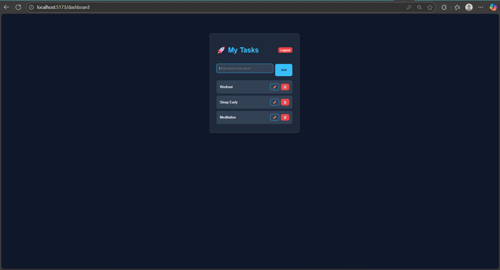

# 🚀 Task Manager Pro

**GitHub**: https://github.com/Abdrahim-123/task-manager-pro

**Frontend**: https://task-manager-pro-git-main-abdul-rahims-projects-15b82580.vercel.app/

**Backend**: https://task-manager-api-9p6q.onrender.com/

**Task Manager Pro** is a full-stack **MERN** application for managing daily tasks with a modern **glassmorphism-inspired UI**.  
The project demonstrates complete **CRUD operations**, **secure authentication**, and **protected routes**, making it a solid example of a production-style web application.

---

## 📸 Preview



---

## ✨ Features

### 🔐 Authentication
- Secure **User Registration & Login**
- Password hashing using **Bcrypt**
- Token-based authentication with **JWT**

### 📝 Task Management
- **Create** new tasks
- **Read** all tasks in a personalized dashboard
- **Update** task titles and completion status
- **Delete** tasks permanently

### 🎨 User Interface
- Modern **Glassmorphism UI**
- Responsive design
- Custom CSS variables and animations

### 🔒 Security
- Protected routes
- Users can access **only their own tasks**
- Secure API endpoints

---

## 🛠️ Tech Stack

### Frontend
- **React** (Vite)
- **React Router DOM**
- **Axios**
- **CSS3** (Custom variables & animations)

### Backend
- **Node.js**
- **Express.js**
- **MongoDB & Mongoose**
- **JSON Web Token (JWT)**
- **BcryptJS**

### Database
- **MongoDB Atlas**

---

## ⚙️ Environment Variables

Create a `.env` file inside the **server** folder and add the following:

```env
MONGO_URI=your_mongodb_connection_string
JWT_SECRET=your_secret_key
PORT=5000
```

---

## 🚀 Run Locally

### 1️⃣ Clone the Repository

```bash
git clone https://github.com/YOUR_USERNAME/task-manager-pro.git
cd task-manager-pro
```

---

### 2️⃣ Backend Setup

```bash
cd server
npm install
```

Create a `.env` file:

```env
MONGO_URI=mongodb+srv://<username>:<password>@cluster0.mongodb.net/taskmanager
JWT_SECRET=mysecretkey123
PORT=5000
```

Start the server:

```bash
node server.js
```

---

### 3️⃣ Frontend Setup

```bash
cd client
npm install
npm run dev
```

---

### 4️⃣ Access the App

Open your browser and visit:

```
http://localhost:5173
```

---

## 📂 Project Structure

```
task-manager-pro/
├── client/
│   ├── src/
│   │   ├── components/
│   │   ├── pages/
│   │   └── App.jsx
├── server/
│   ├── models/
│   ├── routes/
│   └── server.js
└── README.md
```

---

## 👤 Author

**Abdul Rahim Memon**  

